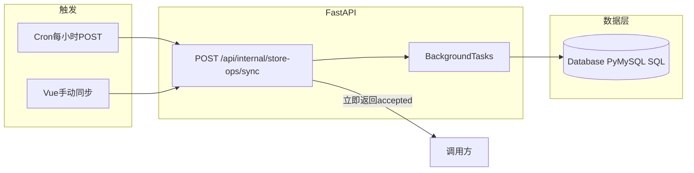

# 店匠员工销售额归因（店铺运营数据表）— 完整实施方案

本文档 = **原实施方案全文（业务、时间、归因、两阶段、权限、数据模型等）** + **技术修订（数据层无 ORM、内部同步接口、BackgroundTasks、已确认业务口径）**。实现时以 [database_new.py](d:/projects/line%20chart/backend/app/services/database_new.py) 的 PyMySQL + 手写 SQL 风格为准。

### 实施进度（2026-04-03 更新）

- **已完成**：迁移 SQL 与用户列、`store_ops_order_attributions` 表；`Database` upsert/聚合；2025-06 客户端与归因；`POST /api/internal/store-ops/sync` + BackgroundTasks；`GET /api/store-ops/report`；`can_view_store_ops` 与 Vue 店铺运营页；根目录 `.env` 由 [config_new.py](d:/projects/line%20chart/backend/config_new.py) 加载；**HTTPS 校验开关** `STORE_OPS_HTTPS_VERIFY`（`os.getenv` + `store_ops_https_verify()`，本地代理可 `false`，生产默认 `true`）；前端 **店铺域名** 在卡片头展示以便区分两店。
- **文档**：[项目开发过程/项目开发过程文档.md](d:/projects/line%20chart/项目开发过程/项目开发过程文档.md)
- **可选后续**：`schema.sql` 全量快照合并、cron 示例脚本、同步任务前端错误提示、两店并行拉单优化。

---

## 第一部分：业务与数据方案（原 §1～§13）

### 1. 目标与范围

- **业务目标**：按**北京时间、按天**查看每个运营员工在每个店匠店铺上的销售额与订单量；无法归因的金额进**公共池**并按规则**虚拟分摊**。
- **店铺范围**：仅 2 店、数据**绝不合并**：`shutiaoes.myshoplaza.com`、`newgges.myshoplaza.com`；同一员工两店两行。
- **技术栈**：FastAPI + [database_new.py](d:/projects/line%20chart/backend/app/services/database_new.py)（PyMySQL）+ Vue；**老同步脚本与 config 中的旧 OpenAPI 版本保持不变**。
- **新功能专用 OpenAPI**：**仅本模块**请求 `https://{shop}/openapi/2025-06/...`；与根目录 [data_sync.py](d:/projects/line%20chart/data_sync.py) / [shoplazza_api.py](d:/projects/line%20chart/shoplazza_api.py) 使用的版本**隔离**，互不改对方配置。

#### 1.1 凭证策略：旧同步 vs 本功能（已定）

| 用途 | Token 来源 | 说明 |

|------|------------|------|

| 既有 `data_sync` / 看板聚合同步 | **`shoplazza_stores.access_token`**（库内现有值） | **保持不变**，不因本功能改写。 |

| 员工归因 Worker / 新模块 API 拉单 | **项目根目录 [`.env`](d:/projects/line%20chart/.env) 中按店变量 **| 仅本功能读取；与上表**隔离**。 |

- **环境变量名（实现时读取）**：  
  - `shutiaoes.myshoplaza.com` → **`SHOPLAZZA_ACCESS_TOKEN_SHUTIAOES`**  
  - `newgges.myshoplaza.com` → **`SHOPLAZZA_ACCESS_TOKEN_NEWGGES`**
- **落地步骤**：在 `.env` 增加上述两行及注释（标明「员工归因等新功能专用」）；**`.env` 已在 [.gitignore](d:/projects/line%20chart/.gitignore) 中**，勿提交；生产环境可用系统环境变量或密钥管理替代文件。
- **实现要求**：Worker / FastAPI 侧本模块调用店匠前 **`load_dotenv()`**（与 [config.py](d:/projects/line%20chart/config.py) 一致），按 `shop_domain` 映射到上述变量取 token；**禁止**误用 `shoplazza_stores` 中旧 token 调 2025-06 新链路（除非日后产品统一，再另行方案）。

---

### 2. 销售额、订单与时间口径

#### 2.1 「成功下单时间」与 `placed_at`（测试 4，已通过）

- **字段约定**：店匠后台订单列表「成功下单」列、列表 URL 参数 `sort_by=placed_at`，与 OpenAPI 订单对象中的 **`placed_at`** 对应同一业务含义（支付/成交时间）。API 常以 **UTC（`...Z`）** 返回，**必须与后台对比时统一换算到北京时间**，不可直接拿 UTC 日历日与后台北京日历日比较。
- **测试 4 验证结论（newgges，2026-04 抽样）**：使用脚本 [`test4_placed_at_admin.py`](d:/projects/line%20chart/test4_placed_at_admin.py)，将 `placed_at` 按与 [`data_sync._get_order_beijing_time`](d:/projects/line%20chart/data_sync.py) **相同规则**转为北京时间后，与后台「成功下单」**逐条一致**。
- **结论**：**统计口径、入库「业务日」、与运营后台对齐**，均以 **`placed_at` 经 `Asia/Shanghai` 转换后的本地时间**为准；**默认不再改用其他时间字段**（如 `created_at`），除非后续出现不一致样本再评估。
- **金额**：`total_price` + `currency`；**仅已支付**（与财务确认：**`financial_status = paid`**，见下文「已确认口径」）。

#### 2.2 采集与落库时的「北京时区」规范（必做）

1. **原始留存**：订单行可保存 API 返回的 **`placed_at` 原始字符串**（便于审计、复算）。
2. **业务归属日 `biz_date`**：由 `placed_at` 解析为带时区时刻后，**转换为 `Asia/Shanghai`**，再取 **DATE**（年-月-日）。**禁止**用未转换的 UTC 日期直接当「北京哪一天」。
3. **展示与报表**：前端/API 返回的「下单时间」类字段，若需人类可读，**统一展示北京时间**（或与 `biz_date` 同源的格式化结果）；与 [data_sync.py](d:/projects/line%20chart/data_sync.py) 现有订单时间处理哲学一致（参见 [Shoplazza时区处理逻辑分析.md](d:/projects/line%20chart/Shoplazza时区处理逻辑分析.md)）。
4. **实现复用**：Worker 内解析函数应与 **`_get_order_beijing_time` / `test4_placed_at_admin.placed_at_to_beijing_naive`** 行为一致，避免同一订单在不同模块算出不同 `biz_date`。
5. **查询窗口**：列表拉取仍使用 **`placed_at_min` / `placed_at_max` 为 +08:00 的 ISO**（见 2.3），与「按北京自然日拉单」一致；**不是**「店匠自动改成北京」的假设，而是**我们显式用北京日界构造请求参数**。

#### 2.3 按「北京自然日」收集（非滑动窗口）

- **单日查询窗口**：对每个北京日历日 \(D\)，使用  

`placed_at_min = D 00:00:00 +08:00`，`placed_at_max = D 23:59:59 +08:00`（与 [utils.datetime_to_iso8601](d:/projects/line%20chart/utils.py) 一致）。

- **同步策略**：订单量预期不大；列表 **`limit=250`**，单日通常 **1～2 次请求**可拉完；分页按 `cursor`/`page` 与 [test_employee_attribution_pull.py](d:/projects/line%20chart/test_employee_attribution_pull.py) 实测行为处理。
- **「每小时一次」含义**：定时任务**每小时执行一轮**；每轮可对 **当日（北京）+ 昨日** 各拉一次完整日界（用于覆盖晚支付、纠偏），仍属于**固定日界**而非任意时间长度的滑动窗口。若业务坚持「每轮只拉当天」亦可，以漏单风险为代价——**推荐每轮至少包含「昨日+今日」两个北京日**（各用一对 min/max）。
- **入库 `biz_date`**：一律由 `placed_at` 转 `Asia/Shanghai` 得到 **DATE**，与查询用的北京日一致（与 §2.2 一致，此处为拉单窗口与入库口径对齐）。

#### 2.4 列表响应解析

- 店匠返回多为 `data.orders`；实现时必须 **unwrap `data.orders`**（旧代码若写 `response.orders` 需在本模块内纠正），与联调脚本一致。

---

### 3. 归因规则（已定）

- **详情字段**：`source`、`last_landing_url`，解析 query 中的 `utm_source`。
- **slug**：`utm_source` **第一个 `-` 之前**一段，与白名单 **大小写不敏感** 匹配。白名单（每店配置，内容可相同）：`xiaoyang`, `kiki`, `jieni`, `amao`, `jimi`, `xiaozhang`, `wanqiu`。
- **末次带 `utm` 但未命中白名单**：**回退首次**；仍无效则公共池。
- **首次 A、末次 B 且均有效**：归 **B**。
- **末次 URL 无 `utm_source` 参数**：按首次。

---

### 4. 两阶段与公共池

- 阶段一：拉单 + 详情 + 落库（归因标记）。
- 阶段二：读时按店、按日期区间聚合；\(S\) 可归属总额、\(P\) 公共池；\(S=0\) 时 \(P\) 按该店**固定 7 人**均分。
- **订单量（采纳建议）**：**订单量 = 直接归因订单数**；公共池**只分摊金额**，不在员工行上强行拆「半单」。

---

### 5. 展示与 API（补充）

- **每员工每店行**：直接销售额、公共分摊、合计、**直接订单数**。
- **每店铺维度（必选）**：该店 **公共订单数**、**公共销售额（池内合计）**；可与员工表同页分区展示或单独接口字段，便于「一眼看到公共池体量」。
- **「全部时间」范围**：按每日最终数据**简单相加**（已确认）。

---

### 6. Worker 性能与并发

- **频率**：**每小时一轮**足够。
- **并发**：**两店并行度 = 2**（两店铺同时拉列表/详情，注意全局限流）；单店内详情请求可小批量串行或低并发（如 2～4），避免触店匠限流，具体以压测微调。

---

### 7. 权限

- 新增 **`can_view_store_ops`**，与 **`can_view_dashboard` 完全独立**（互不为子集）；管理员可在权限页单独授权；默认仅管理员。

---

### 8. 部署（已定稿：HTTP 触发 + BackgroundTasks）

> **修订说明**：原方案曾允许「crontab 直接调 Python 脚本」作为过渡；**现统一为**下方方式，与「第二部分 技术修订」一致。

- **调度**：系统 crontab 或 Node cron（如 `node-cron`）**仅负责定时触发**，例如每小时整点一次。
- **执行**：**`POST /api/internal/store-ops/sync`**（见第二部分 §B），由 FastAPI 受理；**实际拉取店匠、写库放在 `BackgroundTasks` 中**，避免 HTTP 超时。业务逻辑、写库**仅在 Python（FastAPI 进程）一侧**，Node 不重复实现店匠协议。
- **鉴权**：机器调用使用 **`X-Internal-Key`**（或等价）与环境变量比对；人工「立即同步」使用登录用户 + **`can_view_store_ops`**。

---

### 9. 数据模型与索引（摘要）

- 表：`(shop_domain, order_id)` 唯一；**`placed_at_raw`**（API 原始 ISO，常为 UTC）；**`biz_date`**（由 `placed_at` 转 **Asia/Shanghai** 得到的 **DATE**，与后台「成功下单」所属北京日历日一致）；归因结果；可选 `raw_json`。
- 索引：`(shop_domain, biz_date)`。
- **说明**：不在库内混存「未说明时区的日期」作为统计主键；`biz_date` 必须由 §2.2 规则计算写入。
- **技术补充**：表结构用 **SQL DDL** 维护；访问层 **无 ORM**，见第二部分 §A、§C。

---

### 10. 主要改动文件

| 区域 | 说明 |

|------|------|

| 新店匠客户端 | 仅本功能：`/openapi/2025-06`，与旧 `shoplazza_api` 分离或参数化 version |

| DB | [database_new.py](d:/projects/line%20chart/backend/app/services/database_new.py)、[db/schema.sql](d:/projects/line%20chart/db/schema.sql) — **PyMySQL + 手写 SQL，不引入 ORM** |

| API | 新路由 `store-ops`：内部同步 `POST .../sync` + 报表；`BackgroundTasks` |

| 前端 | 新页 + `can_view_store_ops` 路由守卫；可选「手动同步」按钮 |

| 调度 | 仓库外或 `scripts/` 内 cron 示例：仅 `curl`/HTTP 调内部接口 |

---

### 11. 风险与验证

- SSL/代理：与现网一致；开发机可参考 `--insecure` 仅调试。
- 验收：覆盖「首页无 utm」「末次无效回退首次」「两店分列与公共池汇总」。

---

### 12. 工程量

两店、七人、按日拉取 + 详情归因 + 报表与权限，**中等偏小**；主要风险在 **详情量与限流**、**列表 `data.orders` 解析**。

---

### 13. 执行前检查（可作为开发入口条件）

| 项 | 状态 |

|----|------|

| 双店新 token 已写入 `.env` 变量名 | 已约定（§1.1）；实现代码需对接 |

| `placed_at` / `biz_date` / 北京日 | 已验证（§2.1～2.3） |

| 旧同步不改动 `shoplazza_stores` token | 已约定（§1.1） |

**仍可在开发中细化的非阻塞项**：

1. **内部同步接口鉴权**：使用 `POST /api/internal/store-ops/sync` 时，约定 **服务间密钥**（`STORE_OPS_SYNC_SECRET` 等）或仅本机访问，避免公网暴露。
2. **首版回补范围**：上线日是否从某日常量开始，按发布日调整。
3. **Token 轮换**：若 token 曾泄露，在店匠后台轮换后同步更新 `.env`。

---

## 第二部分：技术修订（数据层、接口、已确认口径）

### A. 数据访问层：不引入 ORM

- **原则**：**不引入 SQLAlchemy / 其他 ORM**；与现有后端一致，采用 **PyMySQL + [`Database`](d:/projects/line%20chart/backend/app/services/database_new.py) 类 + 手写 SQL**（`DictCursor`、上下文管理连接）。
- **API 层模型**：使用 **Pydantic（BaseModel）** 仅描述 **HTTP 请求体 / 响应体**，**不**映射数据库表。
- **持久化**：新表 DDL 写入 [`db/schema.sql`](d:/projects/line%20chart/db/schema.sql)（或与现有流程一致）；业务方法放在 `Database` 中新增方法，或拆小模块由同步任务调用，但**执行层仍为参数化 SQL**。
- **BackgroundTasks**：后台任务内 **自行** `Database()` 并 `get_connection()`，用完关闭；**不**依赖请求级「会话」生命周期。

---

### B. 内部同步接口（HTTP + BackgroundTasks）

| 项 | 约定 |

|----|------|

| 方法 / 路径 | `POST /api/internal/store-ops/sync` |

| 耗时逻辑 | **立即返回**；实际拉取店匠、写库、（若需要）阶段二物化逻辑放在 **`BackgroundTasks`** 中执行，避免网关/客户端超时。 |

| 即时响应体 | 建议：`status: accepted`、`sync_run_id`（UUID）、简短 `message`；HTTP 可用 **202** 或 **200**（团队统一一种即可）。 |

| 可选请求体 | `biz_dates: date[]`（不传则默认如昨日+今日北京日）；`shop_domains: string[]`（不传则两店均跑）。 |

**鉴权（两种调用方）**

1. **Cron / 机器**：请求头 **`X-Internal-Key`**（或等价）与 **环境变量**（如 `STORE_OPS_SYNC_SECRET`）比对。
2. **Vue「手动立即同步」**：`Depends(get_current_user)` + 权限 **`can_view_store_ops`**（与第一部分 §7 一致）。

路由注册：在 [`backend/app/main.py`](d:/projects/line%20chart/backend/app/main.py) `include_router` 新增 `store_ops` 模块。

---

### C. 数据表与「模型」边界（无 ORM 实体类）

- **明细表**（与第一部分 §9 一致）：`(shop_domain, order_id)` 唯一；`placed_at_raw`、`biz_date`（北京 `DATE`）、`total_price`、`attribution` 相关字段、可选 `raw_json`、`sync_run_id` 等；索引 `(shop_domain, biz_date)`。
- **无** `declarative_base` / SQLAlchemy `Model` 类；表结构以 **SQL DDL + `Database` 方法** 为唯一来源。
- **阶段二**：优先 **读时聚合**（按 `biz_date` 区间 SQL `GROUP BY`）；若后续需要物化汇总表，仍用手写 SQL / 存储过程，不改为 ORM。

---

### D. 已确认业务口径（防止实现漂移）

| 项 | 约定 |

|----|------|

| `utm` slug | 仅 **7 个固定 slug**（首段 `-` 前）；**大小写不敏感**（如 `XIAOYANG` 等同 `xiaoyang`）。 |

| 货币 | **仅美元**，无多币种换算。 |

| 订单过滤 | **`financial_status = paid`** 才纳入统计。 |

| 展示「全部时间」 | 按日聚合后的**行做简单相加**。 |

| 公共池 S=0 | 该店公共池按 **固定 7 人均分**（与 S>0 时按占比分摊并存为两条规则）。 |

---

### E. 与原方案中「不得改动」范围的关系

- **不修改** 旧 `data_sync` / [`shoplazza_api.py`](d:/projects/line%20chart/shoplazza_api.py) 所用 OpenAPI 版本与 `shoplazza_stores` token 写入逻辑。
- **员工归因** 专用：`openapi/2025-06`、`.env` 中 `SHOPLAZZA_ACCESS_TOKEN_SHUTIAOES` / `SHOPLAZZA_ACCESS_TOKEN_NEWGGES`、`load_dotenv` 映射取 token。
- 测试脚本除外，**不触碰**与员工归因无关的旧同步逻辑。

---

### F. 调度与运维

- **操作系统 / Node cron**：每小时 **`POST`** 上述内部接口一次即可（如每整点 `:00`）；**不**在 cron 里直接跑长耗时 Python 脚本（除非应急），业务单栈在 FastAPI + BackgroundTasks。
- 密钥仅配置在服务器环境或 `.env`，**勿提交仓库**。
- **HTTPS 校验（与旧 `shoplazza_api` 的 `verify=False` 策略对齐方式）**：环境变量 **`STORE_OPS_HTTPS_VERIFY`**，由 [`config_new.store_ops_https_verify()`](d:/projects/line%20chart/backend/config_new.py) 使用 **`os.getenv`** 读取（并先 **`load_dotenv`** 项目根 `.env`）。**默认 `true`**：生产直连公网时正常校验证书，可稳定拉取店匠数据。本地经 SOCKS/系统代理若出现证书校验错误（如 `SSLCertVerificationError`），可设为 **`false`**；生产环境建议 **`true`** 或不配置。`requests` 侧将 `verify` 传入店匠客户端；关闭校验时用 **`urllib3.disable_warnings(InsecureRequestWarning)`** 减少控制台噪音。

---

### G. 实现时可参照的代码位置

- DB：[database_new.py](d:/projects/line%20chart/backend/app/services/database_new.py)
- 路由风格：[dashboard_api.py](d:/projects/line%20chart/backend/app/api/dashboard_api.py)、[auth_api.py](d:/projects/line%20chart/backend/app/api/auth_api.py)
- 依赖：[backend/requirements.txt](d:/projects/line%20chart/backend/requirements.txt)（当前无 sqlalchemy）

---

### 架构示意（触发与数据层）

