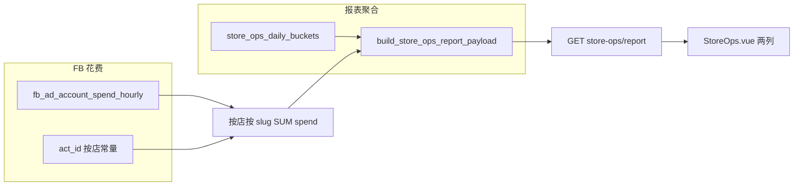

# 店铺运营页：广告花费 + ROAS 列

## 业务规则（已确认）

| 项 | 约定 |

|----|------|

| 店铺与账户批次 | **Bertlove** 批次 `ad_account_id` → **店铺1** `shutiaoes.myshoplaza.com`；**Sunelva** 批次 → **店铺2** `newgges.myshoplaza.com`（与截图一致）。 |

| 分子 | **合计销售额** = 现有 `total_sales`（直接 + 公共池分摊），与 [`store_ops_report.py`](store_ops_report.py)(d:\projects\line chart\backend\app\services\store_ops_report.py) 中每行一致。 |

| 分母 | 该店、该 slug 映射到的 FB 账户在区间内的 **`SUM(spend)`**（[`fb_ad_account_spend_hourly`](fb_ad_account_spend_hourly)(d:\projects\line chart\db\schema.sql)，`time_hour` 为北京时间整点）。 |

| ROAS | **倍数** = `total_sales / spend`；**spend = 0** → 不计算，前端显示 **「—」**；**spend > 0 且 total_sales = 0** → **0**。 |

| 「无」户 | **不进入 7 行**；**方案 A**：页面上**完全不展示**这三户的花费（不单独开一行、不计入任何员工行）。 |

| 币种 | 默认 **USD**，销售额与 spend 直接相除（与现网一致即可）。 |

## 数据依据

- 17 个账户及 `owner` 已在 [`db/migrations/20260408_fb_ad_accounts_sunelva_bertlove_batch.sql`](db/migrations/20260408_fb_ad_accounts_sunelva_bertlove_batch.sql)(d:\projects\line chart\db\migrations\20260408_fb_ad_accounts_sunelva_bertlove_batch.sql)：`Sunelva` 对应行前 7 个 `act_*`，`Bertlove` 对应后 10 个 `act_*`。
- 中文 `owner` → `employee_slug` 与运营归因一致：`小杨→xiaoyang`、`kiki→kiki`、`杰尼→jieni`、`阿毛→amao`、`基米→jimi`、`校长→xiaozhang`、`晚秋→wanqiu`；**`无` 不参与汇总**。

## 架构（数据流）

## 实现步骤

### 1. 后端：账户集合 + 中文到 slug

- 在 [`backend/app/services/store_ops_constants.py`](backend/app/services/store_ops_constants.py)(d:\projects\line chart\backend\app\services\store_ops_constants.py)（或新建 `store_ops_fb_mapping.py` 避免 constants 过大）增加：
  - **`STORE_OPS_FB_ACT_IDS_BY_SHOP: Dict[str, List[str]]`**：`shutiaoes.myshoplaza.com `= Bertlove 10 个 ID；`newgges.myshoplaza.com `= Sunelva 7 个 ID（与迁移 SQL 中列表逐字一致，含 `act_` 前缀）。
  - **`STORE_OPS_OWNER_CN_TO_SLUG: Dict[str, str]`**：上述 7 组中文 → slug；**不包含「无」**。
- 单测或注释中写明与迁移文件的对应关系，便于日后增删户时同步改常量（若后续要 UI 可配置再迁表）。

### 2. 后端：按店、按日区间汇总 spend → slug

- 在 [`backend/app/services/database_new.py`](backend/app/services/database_new.py)(d:\projects\line chart\backend\app\services\database_new.py) 新增方法，例如：  

`fetch_store_ops_fb_spend_by_shop_slug(shop_domain: str, date_start: date, date_end: date) -> Dict[str, Decimal]`

  - SQL：`SELECT m.owner, SUM(h.spend) FROM fb_ad_account_spend_hourly h INNER JOIN ad_account_owner_mapping m ON m.ad_account_id = h.ad_account_id WHERE h.ad_account_id IN (...该店允许列表...) AND DATE(h.time_hour) >= %s AND DATE(h.time_hour) <= %s AND m.owner != '无' GROUP BY m.owner`  
  - Python：将 `owner` 经 `STORE_OPS_OWNER_CN_TO_SLUG` 转为 slug；若遇未知 owner 可记 warning 并跳过，避免脏数据进表。
  - 多日区间与 [`GET /api/store-ops/report`](GET /api/store-ops/report)(GET /api/store-ops/report)(GET /api/store-ops/report)(GET /api/store-ops/report)(d:\projects\line chart\backend\app\api\store_ops_api.py) 的 `start_date`/`end_date`（含端点）保持一致。

### 3. 后端：并入报表 payload

- 在 [`store_ops_api.py`](store_ops_api.py)(d:\projects\line chart\backend\app\api\store_ops_api.py) 的 `get_store_ops_report` 中，在已有 `build_store_ops_report_payload(...)` 之后（或对 payload 做后处理）：
  - 对每个返回的 `shop_domain`，调用 `fetch_store_ops_fb_spend_by_shop_slug`。
  - 对每个 `employee_rows` 项：写入 **`fb_spend`**（float 两位）、**`roas`**（`None` 表示前端显示「—」；否则为 `round(total_sales / spend, 2)` 或 0 按规则）。
- 逻辑严格按：**spend==0 → roas=null**；**spend>0 且 total_sales==0 → roas=0**。

可选：将合并逻辑放在 [`store_ops_report.py`](store_ops_report.py)(d:\projects\line chart\backend\app\services\store_ops_report.py) 新增函数 `merge_fb_spend_into_payload(payload, spend_by_shop_slug)`，便于单测。

### 4. 前端

- [`frontend/src/api/storeOps.ts`](frontend/src/api/storeOps.ts)(d:\projects\line chart\frontend\src\api\storeOps.ts)：`employee_rows` 类型增加 `fb_spend: number`、`roas: number | null`。
- [`frontend/src/views/StoreOps.vue`](frontend/src/views/StoreOps.vue)(d:\projects\line chart\frontend\src\views\StoreOps.vue)：表头增加 **广告花费**、**ROAS**；花费格式与现有金额列一致（如 `$x.xx`）；**`roas === null` 显示「—」**，否则显示倍数（如 `3.25`，无需百分号）。

### 5. 验证

- 选一日期范围，手工核对：某店某 slug 的 `fb_spend` 是否等于对该店 act 列表、该 owner 的 SQL 汇总（排除「无」）。
- 边界：某 slug 在该店无账户 → spend 0、ROAS「—」；仅有花费无销售额 → ROAS 0。

## 不在本次范围

- 「无」户花费的单独展示或店铺级汇总（方案 A）。
- 非 USD 汇率（若未来 `currency` 非 USD 再扩展）。
- TikTok 花费（仅 FB）。

## 风险与说明

- **账户列表与迁移强耦合**：新增/换户需同时改常量与（可选）迁移映射；文档中注明维护点。
- **`time_hour` 与 `biz_date`**：均按北京日历对齐；多日报表为区间内所有北京日期的花费之和，与店匠 `biz_date` 区间一致即可满足当前「同一日期范围相除」的约定。