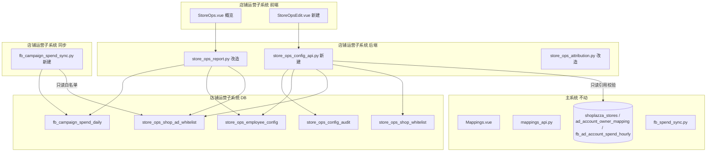

# 店铺运营子系统独立重构（修订版）

## 0. 当前完成状态（2026-04-22，窗口内已落地）

- **阶段 A（数据层）已完成**：
  - 已产出并执行迁移 SQL：`db/migrations/20260422_store_ops_subsystem.sql`
  - 已完成 5 张新表 + `users.can_edit_store_ops_config` 建立
  - 已产出并执行回填脚本：`scripts/backfill_store_ops_subsystem.py`
  - 回填结果：`shops=2`、`ad_whitelist=24`、`operators=8`，且二次 dry-run 全部 `SKIP`（幂等通过）
- **阶段 B（后端）进行中**：
  - 已新建并接入只读配置 API：`backend/app/api/store_ops_config_api.py`
  - 已完成并验证 5 个 GET 接口返回 200（shops / available-shops / ad-accounts / available-ad-accounts / operators）
  - 已打通新权限字段后端链路：
    - `database_new.py`：读取/更新 `can_edit_store_ops_config`
    - `auth_api.py`：登录与 `me` 返回该字段
    - `permissions_api.py`：可更新该字段（默认普通用户关闭）
  - 仍待完成：`store_ops_config_api.py` 的写接口（POST/PATCH/DELETE）+ 独立审计写入
- **阶段 B 已完成 B.1 / B.2 / B.3**（2026-04-22 窗口内继续推进）：
  - B.2 改造 `backend/app/services/store_ops_attribution.py`：已切到 `store_ops_employee_config`，带 30s TTL 缓存 + 故障降级链（DB 失败降级旧缓存 → 无缓存兜底常量）；新增 `match_employee_by_campaign` 为 B.3 预留
  - B.2 配套 SQL：`UPDATE store_ops_employee_config SET utm_keyword='cookie' WHERE employee_slug='quqi'` 已执行，`cookie → quqi` 硬编码彻底下沉到数据行
  - 22/22 单元测试 + 5/5 活体 DB/缓存/降级链路验证全绿
  - B.3 新建 `fb_campaign_spend_sync.py` + `run_fb_campaign_spend_sync.bat` + `run_fb_campaign_spend_sync_yesterday.bat`
  - 读 `store_ops_shop_ad_whitelist` 启用账户 → FB Graph API `level=campaign` → REPLACE INTO `fb_campaign_spend_daily` → 对账 warning 写 `operation_logs`
  - 15/15 纯函数单元测试 + 活体 dry-run（24 账户/52 系列）+ 真实写入 + 幂等重跑 + 端到端归因演练均通过
  - 2026-04-21 实测对账偏差最大 0.22%（远低于 1% 阈值，0 warning）；`act_1704935604203382` 授权 403 为主系统外部问题，脚本已优雅兜底
- **阶段 B 已全部完成**（B.1 ~ B.4 + E2E 端到端演练）
- **阶段 C.1 已完成**：`store_ops_config_api.py` 写接口 + 审计 + 28/28 smoke test
- **下一里程碑**：
  - C.3 观察 1-2 同步周期后清理 `store_ops_constants` / `store_ops_fb_mapping` 数据常量

### 0.1 本窗口新增落地明细（2026-04-22 补充）

- **B.2（UTM 归因 DB 化）已完成**：
  - `backend/app/services/store_ops_attribution.py` 已改造为读取 `store_ops_employee_config`
  - 已实现 30s TTL 缓存 + 故障降级链（DB 失败降级旧缓存，无缓存兜底常量）
  - 已新增 `match_employee_by_campaign(campaign_name, operators)` 供系列归因复用
  - 配套数据修正已执行：`employee_slug='quqi'` 的 `utm_keyword` 更新为 `cookie`，`cookie -> quqi` 从代码硬编码迁移为数据驱动
- **B.3（系列级同步）已完成**：
  - 新增 `fb_campaign_spend_sync.py`
  - 新增 `run_fb_campaign_spend_sync.bat`、`run_fb_campaign_spend_sync_yesterday.bat`
  - 同步链路：启用账户 -> Graph API level=campaign -> `fb_campaign_spend_daily`
  - 对账链路：与 `fb_ad_account_spend_hourly` 同日同账户对账，差值 >1% 写 `operation_logs` warning
- **验证结果**：
  - B.2：22/22 单测通过 + 5/5 活体验证通过
  - B.3：15/15 单测通过 + 全量 dry-run（24 账户/52 系列）+ 真实写入 + 幂等重跑通过
  - 2026-04-21 对账最大偏差 0.22%，0 warning；`act_1704935604203382` 出现 FB 403（账户授权缺失，脚本已优雅兜底）

### 0.2 本窗口新增落地明细（2026-04-22 补充，B.4 / C.1 / E2E）

- **B.4（报表聚合改造）已完成**：
  - `backend/app/services/database_new.py::fetch_store_ops_fb_spend_by_shop_slug` 改造为从 `fb_campaign_spend_daily` 按系列取数 + JOIN `store_ops_shop_ad_whitelist(is_enabled=1)` 过滤 + `match_employee_by_campaign` 归因
  - 返回结构新增 `_unattributed` 桶（`campaign_keyword` 为空或 `__unset_` 前缀、或无命中），在 `merge_fb_spend_into_payload` 中聚合到 shop 级新字段 `unattributed_fb_spend`
  - `store_ops_report.build_store_ops_report_payload` 改为动态取 `get_active_operators()` 并按 `sort_order` 排员工行；历史 slug（已在销售桶但当前已被 block/delete）按字母序追加，保证历史销售额不丢
  - 公共池分摊分母改为 active 运营数量
  - 9 条 B.4 专项单测 + 3 条旧 FB merge 单测 + 22 条归因单测 + 15 条系列同步单测 = 49/49 全绿
- **C.1（配置写接口 + 审计）已完成**：
  - `backend/app/api/store_ops_config_api.py` 全量补齐：
    - 7 个写接口（shops / ad-accounts / operators 各 POST/PATCH/DELETE，operators 额外用 `__unset_{slug}` 占位兜底空 `campaign_keyword`）
    - 新 GET `/api/store-ops/config/audit`：分页 + 过滤（resource_type / action / resource_key）
  - 引入 `require_can_edit_store_ops_config` 依赖 + `_write_audit(cur, ...)` 统一审计 helper
  - `_invalidate_operator_cache()` 在 operator 写后清零 TTL 缓存，PATCH 立即生效于下次 `/api/store-ops/report`
  - 软删策略：operators 用 `deleted_at=NOW()`；shops / ad-accounts 用 `is_enabled=0`
  - 28/28 冒烟测试（`scripts/smoke_c1_store_ops_config_api.py`）全绿，涵盖登录、401/404/409、幂等、block/unblock、审计校验、JSON payload 解析
- **E2E 端到端演练（2026-04-21 真实数据）已完成**：
  - M1 `scripts/explore_campaign_attribution.py`：52 系列、1207.06 花费、全部有主系统 owner 标识，命名覆盖率 45/52 ≈ 86.5%；其余 7 条（`Mankit-*` x1 + `kala-*` x4 + 其他）属于命名不规范的漏网之鱼，正是"未归属桶"的业务价值
  - M2 `scripts/sandbox_b4_report.py`：monkey-patch `get_active_operators` 注入 8 个真实 keyword 跑 B.4，DB 零写入；守恒 1207.06 ✅，归属 95.3%（1150.40），未归属 4.7%（56.66）
  - M3 `scripts/apply_real_campaign_keywords.py --apply`：通过 C.1 `PATCH /api/store-ops/config/operators/{id}` 真实写入 7 条 `campaign_keyword`（`xiaoyang/jieni/amao/jimi/xiaozhang/wanqiu` 用 slug，`quqi` 用 `cookie`，`kiki` 保持 `__unset_kiki`）
  - 调 `/api/store-ops/report` 验证：
    - shutiaoes.myshoplaza.com：unattributed 837.50 → 17.40（`Mankit-*`），xiaoyang 340.50 / ROAS=1.85，amao 323.88 / ROAS=1.27，jieni 38.34 / ROAS=3.68
    - newgges.myshoplaza.com：unattributed 369.56 → 39.26（`kala-*` x4），wanqiu 96.45 / ROAS=2.24，quqi 131.75，amao 74.51，xiaozhang 27.59
    - 两店合计 before=after（守恒 diff=0.0000，PASS）
  - 审计全程留痕：`/api/store-ops/config/audit?resource_type=operator&action=update` 可见 7 条结构化 `campaign_keyword: '__unset_xxx' -> 'xxx'` 变更
  - 备份落盘：`scripts/_tmp_campaign_keyword_backup.json`，一键 `--rollback` 即可还原
- **下一步**：
  - C.2.b（可选）：`unattributed_fb_spend` 在前端以独立行/Tooltip 呈现，辅助运营主动修正 campaign 命名
  - C.3：观察 1-2 同步周期后清理 `store_ops_constants` / `store_ops_fb_mapping` 中的数据常量

## 1. 核心边界（本方案最关键的前置约束）

- **主系统零改动**（保持原样）：
  - 表：`shoplazza_stores`、`ad_account_owner_mapping`、`fb_ad_account_spend_hourly`、`store_owner_mapping`、`mapping_resource_audit`
  - 脚本：[fb_spend_sync.py](fb_spend_sync.py)、`run_fb_spend_sync.bat`、`sync_yesterday_fb_spend.py`
  - 页面：[frontend/src/views/Mappings.vue](frontend/src/views/Mappings.vue)、[frontend/src/views/MappingAuditLog.vue](frontend/src/views/MappingAuditLog.vue)
  - API：[backend/app/api/mappings_api.py](backend/app/api/mappings_api.py)、[backend/app/api/audit_api.py](backend/app/api/audit_api.py)
- **店铺运营子系统完全独立**：新表、新 API、新页面、新权限、新审计、新同步任务。任何"从主系统选数据"的交互都是**只读引用**，绝不在店铺运营 UI 里 CUD 主系统数据。
- **白名单语义统一**：
  - 店铺：必须已在 `shoplazza_stores` 存在，才能"加入"店铺运营子系统（新增动作仅是在子系统插一条引用行）
  - 广告账户：必须已在 `ad_account_owner_mapping` 存在，才能"加入"店铺运营子系统并绑到某家店铺
- **分工约定**：涉及 `mysql` / `ALTER` / `CREATE TABLE` / `bat` 调度 / 回填脚本执行的**命令由你亲自执行**；代码、SQL 文件、PS1 脚本、前端改造由我完成产出。每阶段我会给出明确的"请执行 X，把结果贴给我再继续"的验证步骤。

## 2. 业务规则（最终口径）

- **广告账户只绑店铺**：废弃"账户→单运营"和"账户→多运营"两套逻辑；一个店铺的全部启用账户下的所有广告系列，合成为该店的"系列池"。
- **运营全局配置**：运营人员是全局列表，跨店共用；不再与任何广告账户做绑定关系。新增店铺"自动复制一套配置"的效果通过"运营是全局的"天然达成（不需要物理复制行）。
- **归因规则**：对一条 `campaign_name`，按运营 `sort_order ASC, id ASC` 遍历，首位 `campaign_keyword.lower() in campaign_name.strip().lower()` 命中者胜出；未命中进入"未归属"桶（不并入订单 public_pool）。
- **UTM 订单归因**：原 `EMPLOYEE_SLUGS_ORDERED` 改为读 `store_ops_employee_config.utm_keyword`，带进程级 TTL 缓存；`cookie → quqi` 这类硬编码迁到该表行数据。
- **关键词全局唯一**：`utm_keyword` 和 `campaign_keyword` 都 DB 层 `UNIQUE` + 保存时二次校验（去空白、全小写后比较）。
- **停用/屏蔽/删除**：
  - 店铺停用：前端不展示、同步任务跳过；再启用可恢复
  - 账户停用：新同步跳过；历史 `fb_campaign_spend_daily` 数据保留
  - 运营 `blocked`：前端不展示，但同步/归因继续算（保留数据）
  - 运营删除：软删 `deleted_at`，读侧按存活性过滤，历史系列数据保留

## 3. 架构总览

## 4. 数据模型（全部新增，不改动主库旧表）

### 4.1 三张配置表 + 一张系列花费表 + 一张独立审计表

- `store_ops_shop_whitelist`
  - `id`、`shop_domain`（UNIQUE，保存时校验在 `shoplazza_stores` 存在）
  - `is_enabled` TINYINT(1)、时间戳
- `store_ops_shop_ad_whitelist`
  - `id`、`shop_domain`（FK 逻辑指向上表）、`ad_account_id`（**UNIQUE**，全局唯一）、`is_enabled`、时间戳
  - 保存时校验 `ad_account_id` 在 `ad_account_owner_mapping` 存在
  - **废弃原「账户→运营」子表设计**，此表不保存任何运营 slug
- `store_ops_employee_config`
  - `id`、`employee_slug`（UNIQUE，`[a-z][a-z0-9_]{1,31}`）、`display_name`
  - `utm_keyword`（UNIQUE NOT NULL，存小写）
  - `campaign_keyword`（UNIQUE NOT NULL，存小写）
  - `status` ENUM('active','blocked') DEFAULT 'active'
  - `sort_order` INT（多词歧义时稳定排序；UI 不暴露拖拽，按创建顺序自动分配）
  - `deleted_at` DATETIME NULL、时间戳
- `fb_campaign_spend_daily`
  - `stat_date` DATE、`ad_account_id`、`campaign_id`、`campaign_name`、`spend` DECIMAL(18,4)、`currency`、时间戳
  - `UNIQUE(ad_account_id, campaign_id, stat_date)`
  - 索引 `(stat_date)`、`(ad_account_id, stat_date)`
- `store_ops_config_audit`（**不复用主系统 `mapping_resource_audit`，完全独立**）
  - `id`、`resource_type` ENUM('shop','ad_whitelist','operator')、`resource_key`、`action` ENUM('create','update','delete','enable','disable','block','unblock')、`actor_user_id`、`request_payload` JSON、`created_at`

### 4.2 权限列

- `users` 新增 `can_edit_store_ops_config` TINYINT(1) DEFAULT 0（与 `can_edit_mappings`、`can_view_store_ops` 并列，**不影响**已有权限）

> **SQL 文件会统一放到** `db/migrations/20260422_store_ops_subsystem.sql`，由你亲自执行。

## 5. 后端改造（新增 + 最小化改造）

### 5.1 新建 [backend/app/api/store_ops_config_api.py](backend/app/api/store_ops_config_api.py)

- 店铺：
  - `GET /api/store-ops/config/shops` 列表（含启用状态）
  - `GET /api/store-ops/config/available-shops` 从 `shoplazza_stores` 读取"可加入"候选（只读）
  - `POST /api/store-ops/config/shops` 新增（校验存在于主表 + 未重复）
  - `PATCH /api/store-ops/config/shops/{domain}` 启用/停用
- 广告账户白名单：
  - `GET /api/store-ops/config/ad-accounts?shop_domain=...`
  - `GET /api/store-ops/config/available-ad-accounts` 从 `ad_account_owner_mapping` 读取候选（排除已被其他店占用的）
  - `POST /api/store-ops/config/ad-accounts` 新增（选店铺 + 选账户）
  - `PATCH /api/store-ops/config/ad-accounts/{id}` 启用/停用
  - `DELETE /api/store-ops/config/ad-accounts/{id}` 真删（需二次确认）
- 运营：
  - `GET /api/store-ops/config/operators`（支持 include_deleted / status 过滤）
  - `POST /api/store-ops/config/operators`（必填：slug / display_name / utm_keyword / campaign_keyword；全局唯一校验）
  - `PATCH /api/store-ops/config/operators/{id}`（改关键词 / 名称 / status）
  - `DELETE /api/store-ops/config/operators/{id}`（软删）
- 全部写操作落 `store_ops_config_audit`，权限校验 `can_edit_store_ops_config`

### 5.2 [backend/app/services/store_ops_attribution.py](backend/app/services/store_ops_attribution.py) 改造

- `match_employee_slug` 改为从 `store_ops_employee_config` 读 `status='active' AND deleted_at IS NULL`，按 `sort_order ASC, id ASC` 匹配 `utm_keyword`
- 进程内缓存 + 30s TTL；失败时降级最近一次成功缓存（避免订单同步中断）
- 删除 [store_ops_constants.py](backend/app/services/store_ops_constants.py) 的 `EMPLOYEE_SLUGS_ORDERED` 依赖（稳定后再清理常量文件）
- 新增纯函数 `match_employee_by_campaign(campaign_name, active_operators)` 供系列归因复用

### 5.3 新建 `fb_campaign_spend_sync.py`（与 [fb_spend_sync.py](fb_spend_sync.py) 并列，不动老脚本）

- 入口：`--date / --start / --end / --incremental`
- 账户来源：`SELECT ad_account_id FROM store_ops_shop_ad_whitelist WHERE is_enabled=1`
- Graph API：`insights?level=campaign&fields=campaign_id,campaign_name,spend,account_currency&time_range=...`
- 写表：`REPLACE INTO fb_campaign_spend_daily`
- 复用 [config.py](config.py) 的 `DB_CONFIG` / `FB_LONG_LIVED_TOKEN`
- 对账日志：同日全账户 `SUM(spend)` vs `fb_ad_account_spend_hourly` 同日同账户 `SUM(spend)`，差值 > 1% 写 `operation_logs` warning
- 配套脚本：`run_fb_campaign_spend_sync.bat` / `run_fb_campaign_spend_sync_yesterday.bat`（**任务计划由你亲自注册**）

### 5.4 报表改造

- [backend/app/services/database_new.py](backend/app/services/database_new.py) 的 `fetch_store_ops_fb_spend_by_shop_slug`：
  - `FROM fb_campaign_spend_daily c JOIN store_ops_shop_ad_whitelist w ON c.ad_account_id=w.ad_account_id AND w.is_enabled=1 AND w.shop_domain=?`
  - SQL 只做 `GROUP BY campaign_id, campaign_name` 降维
  - Python 层用"激活运营列表"做 campaign_name 匹配 → `{employee_slug: spend, _unattributed: spend}`
- [backend/app/services/store_ops_report.py](backend/app/services/store_ops_report.py) 的 `merge_fb_spend_into_payload` 增加"未归属"桶透出；若产品暂不展示可保留字段不渲染

### 5.5 店铺运营前端概览 [frontend/src/views/StoreOps.vue](frontend/src/views/StoreOps.vue)

- 不改页面结构；仅需要：
  - 停用店铺从概览中隐藏（读后端过滤结果即可，前端无改动）
  - 运营列等于全局激活运营列表（后端聚合数据已经按此口径）
  - 行合计的分母/分子与新口径一致

## 6. 前端新建 [frontend/src/views/StoreOpsEdit.vue](frontend/src/views/StoreOpsEdit.vue)

三块卡片（与主系统 Mappings.vue 视觉风格对齐，但**独立路由独立菜单**）：

- **店铺白名单**：
  - 列表（shop_domain / 启用状态 / 时间）
  - 新增：下拉从"可加入候选"选一个主系统店铺 → 确认入库
  - 行操作：启用 / 停用
- **广告账户白名单**：
  - 列表（ad_account_id / 所属店铺 / 启用状态）
  - 新增：选店铺 + 从"未被占用的主系统账户候选"选账户
  - 行操作：启用 / 停用 / 删除
- **运营人员**：
  - 列表（slug / display_name / utm_keyword / campaign_keyword / status）
  - 新增：填 slug / 中文名 / utm 关键词 / 系列关键词（前端实时查重 + 后端 400 兜底）
  - 行操作：编辑 / 屏蔽(switch) / 删除(二次确认)

- 路由 `router/store-ops/edit`；菜单项"店铺运营编辑"受 `can_edit_store_ops_config` 守卫
- 权限管理页 [frontend/src/views/Permissions.vue](frontend/src/views/Permissions.vue) + [backend/app/api/permissions_api.py](backend/app/api/permissions_api.py) 增一个开关

## 7. 迁移与回填（SQL/命令由你执行）

### 阶段 A（数据层）

1. 我产出：`db/migrations/20260422_store_ops_subsystem.sql`（建 5 张表 + users 权限列）
2. 你执行：`mysql ... < db/migrations/20260422_store_ops_subsystem.sql`
3. 我产出：回填脚本 `scripts/backfill_store_ops_subsystem.py`

   - `store_ops_shop_whitelist` ← [store_ops_constants.py](backend/app/services/store_ops_constants.py) `STORE_OPS_SHOP_DOMAINS`
   - `store_ops_shop_ad_whitelist` ← [store_ops_fb_mapping.py](backend/app/services/store_ops_fb_mapping.py) `STORE_OPS_FB_ACT_IDS_BY_SHOP`（**即你说的"现有页面里绑定了单个运营的广告账户"批量转成只绑店铺**）
   - `store_ops_employee_config` ← `EMPLOYEE_SLUGS_ORDERED` + `STORE_OPS_OWNER_CN_TO_SLUG`；`utm_keyword = slug`；`campaign_keyword` 先写占位如 `__unset_{slug}` 保证 UNIQUE，等 UI 完成后运营手动补填

4. 你执行：`python scripts/backfill_store_ops_subsystem.py --dry-run` 预览 → 无误再加 `--apply`
5. 验证：`SELECT COUNT(*) FROM store_ops_shop_whitelist;` 等 3 张表条数匹配预期；**把结果贴给我再进下一步**

### 阶段 B（后端 + 同步）

6. 我完成：`store_ops_config_api.py` + `store_ops_attribution.py` DB 读取 + 报表从新表走
7. 你执行：后端本地重启，调 `GET /api/store-ops/config/shops` / `.../operators` 返回 200
8. 我完成：`fb_campaign_spend_sync.py` + `run_fb_campaign_spend_sync.bat`
9. 你执行：`python fb_campaign_spend_sync.py --date YYYY-MM-DD` 跑一天 → `SELECT COUNT(*) FROM fb_campaign_spend_daily WHERE stat_date='YYYY-MM-DD';` 给我条数
10. 验证：同店同日 `SUM(spend)` ≈ `fb_ad_account_spend_hourly` 同日同账户 `SUM(spend)`（差值 < 1%）

### 阶段 C（前端 + 权限 + 收尾）

11. 我完成：`StoreOpsEdit.vue` + 路由菜单 + 权限守卫 + 权限管理页开关
12. 你执行：前端打包 → 在 UI 上补齐真实 `campaign_keyword`（替换 `__unset_*` 占位）
13. 你执行：把 `run_fb_campaign_spend_sync.bat`（或 `run_fb_campaign_spend_sync_yesterday.bat`）注册到 Windows 任务计划（增量 5–10 分钟一次 / 昨日全量 08:05）
14. 观察 1–2 个同步周期 → 稳定后我清理 [store_ops_constants.py](backend/app/services/store_ops_constants.py) / [store_ops_fb_mapping.py](backend/app/services/store_ops_fb_mapping.py) 的数据常量（仅保留函数/签名，或整体删除）

## 8. 验收清单

- 主系统 `Mappings.vue` 页面、主同步任务、看板数字：**零变化**（可 diff `fb_ad_account_spend_hourly` 某日总和前后一致）
- 店铺运营编辑页：添加/停用店铺、添加/停用/删除账户、增/改/屏蔽/删运营 全部走 `can_edit_store_ops_config`
- 停用店铺：概览页隐藏；`fb_campaign_spend_sync` 跳过该店全部账户
- 屏蔽运营：UI 不显示；`fb_campaign_spend_daily` 依旧有数据；UTM 订单归因不将 UTM 归给他（由 status 过滤）
- 删除运营：软删；历史报表不再出现该 slug；其他运营数据不变
- 归因边界样例单测：`jie` 与 `jieni` 同时存在时，`sort_order` 靠前者胜出；未命中进入"未归属"桶
- 对账：连续 3 天内，每日系列汇总 vs 账户汇总差值 < 1%；>1% 则 `operation_logs` 有 warning

## 9. 风险与规避

- **Campaign Insights 限流**：只拉启用账户、按天粒度；沿用老脚本的异步报告 + 重试风格
- **关键词歧义**：全局 UNIQUE + `sort_order` tiebreaker + UI 实时查重
- **UTM 归因切 DB 的中断风险**：进程内缓存 + 失败时用最近一次缓存兜底
- **主系统误伤**：所有写入仅落新表；对 `shoplazza_stores`/`ad_account_owner_mapping` 只做 `SELECT`；独立审计表避免污染 `mapping_resource_audit`
- **回填占位词**：`__unset_{slug}` 不会被任何真实 campaign 命中（保证不误归），UI 上用红色提示"未配置"