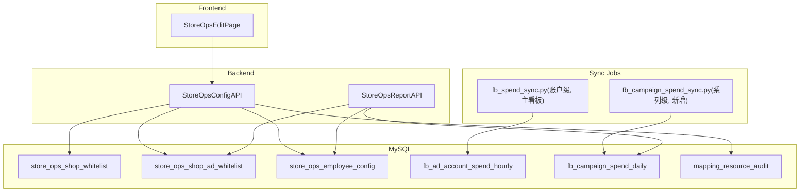

# 店铺运营按系列归因重构（新执行版）

## 1. 目标与边界

- **核心转变**：不再按「账户 → 人」绑定，也不再区分「单 / 多运营」两条路径；统一按**店铺**视角，将该店全部广告账户下的所有广告系列，用**系列名称关键词**匹配到**全局**运营人员。
- **数据隔离**：店铺仍是数据隔离单元（店匠订单 + 其绑定的 FB 账户/系列）。
- **不影响主看板**：新增独立同步任务 + 独立系列级花费表，保留现有 [fb_spend_sync.py](fb_spend_sync.py) 写 `fb_ad_account_spend_hourly` 的链路不动。
- **废弃规则**（相对老方案）：
  - 废弃 `store_ops_ad_account_operator`（账户 ↔ 运营多对多绑定）、`sort_order`、`campaign_keyword` 挂在账户上。
  - 废弃「映射 owner 与首位运营强校验」。
  - 废弃「未命中归首位」——改为未命中进入「未归属」展示（见 §4.3）。
- **保留**：软禁用店铺、审计、新权限 `can_edit_store_ops_config`、冲突检测。

## 2. 全局澄清（用户已确认）

- **运营作用域**：全局定义，所有店铺共用一份运营名单与其关键词。「新增店铺自动复制运营配置」理解为：新店自动应用全部启用中的运营规则，**无需物理复制行**。
- **关键词唯一性**：`utm_keyword` 与 `campaign_keyword` 均**全局唯一**（DB 层 `UNIQUE` 约束 + 保存校验）。

## 3. 架构总览

核心数据流：`店铺 -> 其所有 ad_account -> fb_campaign_spend_daily -> 关键词匹配到 operator -> 报表按店按人聚合`。

## 4. 数据模型

### 4.1 配置表（3 张 + 审计复用）

- `store_ops_shop_whitelist`
  - `shop_domain`（UNIQUE，需存在于主映射店铺表），`is_enabled`，时间戳
  - 停用即软删除；前端不再展示、同步任务跳过
- `store_ops_shop_ad_whitelist`
  - `id`、`shop_domain`（FK 逻辑指向上表）、`ad_account_id`、`is_enabled`，时间戳
  - `UNIQUE(ad_account_id)`（跨店全局唯一，账户永远只属一家店）
  - `ad_account_id` 校验需存在于 `ad_account_owner_mapping`（与现有约束一致）
- `store_ops_employee_config`（全局运营人员）
  - `id`、`employee_slug`（UNIQUE，`[a-z][a-z0-9_]{1,31}`）
  - `display_name` 中文显示名
  - `utm_keyword`（**UNIQUE NOT NULL**，存小写）
  - `campaign_keyword`（**UNIQUE NOT NULL**，存小写）
  - `status` enum（`active` / `blocked`）——对应「启用 / 屏蔽」；屏蔽 = 前端不展示但数据保留、同步照算
  - `sort_order` INT，用于**多词同时命中时的稳定 tiebreaker**（见 §4.3）
  - 时间戳 + `deleted_at`（软删除列）
- 复用 `mapping_resource_audit`，新增 `resource_type`：
  - `store_ops_shop` / `store_ops_ad_whitelist` / `store_ops_operator`

### 4.2 系列级花费表（新增，同步目标）

- `fb_campaign_spend_daily`
  - `stat_date`（DATE，业务日，北京时区口径，与看板一致）
  - `ad_account_id`、`campaign_id`、`campaign_name`
  - `spend`（DECIMAL(18,4)）、`currency`
  - `created_at` / `updated_at`
  - `UNIQUE(ad_account_id, campaign_id, stat_date)`
  - 索引：`(stat_date)`、`(ad_account_id, stat_date)`
- **不落 `campaign_name` 小写副本**，归因时读取处做 `strip().lower()`（与 [store_ops_attribution.py](backend/app/services/store_ops_attribution.py) 现有风格保持一致）。

### 4.3 归因规则（新统一规则）

- 仅对 **`is_enabled=1` 的白名单账户**参与归因（停用账户不入系列同步，也不回溯）。
- 输入：`campaign_name`。对每个 `active` 运营按 `sort_order ASC, id ASC` 遍历：若 `operator.campaign_keyword.lower() in campaign_name.strip().lower()` → 命中该运营。
- **首次命中优先**（关键词全局唯一 + 稳定排序保证结果可重复）。
- **未命中**：在报表上以「未归属 (unattributed)」独立列/桶展示；**不并入订单那套 public_pool**，因为那是订单归因的概念，花费不参与订单公共池分摊。

（若产品想在 UI 上把「未归属」和订单 public_pool 合并展示，也可在读取层决定，不影响底表。）

## 5. 后端改造

### 5.1 配置 CRUD

- 新增 [backend/app/api/store_ops_config_api.py](backend/app/api/store_ops_config_api.py)：
  - 店铺：`GET/POST/PATCH /api/store-ops/config/shops`（启用/停用）
  - 广告账户白名单：`GET/POST/PATCH/DELETE /api/store-ops/config/ad-accounts`（新增需选已启用店铺；停用即 `is_enabled=0`）
  - 运营：`GET/POST/PATCH/DELETE /api/store-ops/config/operators`
    - `POST`：校验 `utm_keyword` / `campaign_keyword` 全局唯一（去小写去空白后比较）
    - `PATCH`：支持改关键词、切 `status=active/blocked`
    - `DELETE`：软删 `deleted_at`；同步 warning 级审计并提示：历史系列归因结果由读侧依赖 `employee_slug` 存在性，过滤即可（不动历史订单归因）
- [backend/app/services/database_new.py](backend/app/services/database_new.py) 增对应 CRUD 与冲突检测。
- 审计：写 `mapping_resource_audit`，`request_payload` 脱敏（参考映射资源审计写法）。

### 5.2 UTM 归因从 DB 读

- 重构 [backend/app/services/store_ops_attribution.py](backend/app/services/store_ops_attribution.py) 中的 `match_employee_slug`：
  - 原本读硬编码 `EMPLOYEE_SLUGS_ORDERED`，改为读 `store_ops_employee_config` 的 `active` 运营，按 `sort_order ASC, id ASC` 遍历，以 `utm_keyword` 做子串匹配。
  - 为避免每次 IO，建议加**进程级内存缓存 + 30-60 秒 TTL**（订单同步吞吐较高）。
  - `cookie → quqi` 这类特殊规则迁移为 DB 中 `quqi` 行的 `utm_keyword='cookie'` 即可，代码里不再写死。

### 5.3 报表读取

- 改造 [backend/app/services/database_new.py](backend/app/services/database_new.py) 中的 `fetch_store_ops_fb_spend_by_shop_slug`：
  - 从 `fb_campaign_spend_daily` 聚合：`JOIN store_ops_shop_ad_whitelist` 过滤本店启用账户 → 按系列聚合到当期区间 → 读 `store_ops_employee_config` 激活列表做内存匹配 → 汇成 `{employee_slug: spend}` + `{unattributed: spend}`。
  - SQL 层只做 `GROUP BY ad_account_id, campaign_id, campaign_name` 降维，**关键词匹配放在 Python 层**（关键词数量少，系列也有限，性能可接受，且方便改规则）。
- [backend/app/services/store_ops_report.py](backend/app/services/store_ops_report.py) 的 `merge_fb_spend_into_payload` 中，增加「未归属」桶的透出字段（若产品不需要可先不渲染）。
- **对账日志**：同店、同区间下，系列汇总 vs `fb_ad_account_spend_hourly` 按账户合计之差若 > 阈值（比如 1%）则打 `warning` 到 `operation_logs`（与现有风格一致）。

### 5.4 独立同步任务

- 新建 `fb_campaign_spend_sync.py`（与 [fb_spend_sync.py](fb_spend_sync.py) 并列）：
  - 入口参数与老脚本风格一致：`--date / --start / --end / --incremental`
  - 账户来源：`SELECT ad_account_id FROM store_ops_shop_ad_whitelist WHERE is_enabled=1`
  - 调用 Graph API `insights?level=campaign&fields=campaign_id,campaign_name,spend,...`
  - 写 `fb_campaign_spend_daily`，`REPLACE INTO` 语义（与老脚本一致）
  - 复用 [config.py](config.py) 的 `DB_CONFIG` 与 `FB_LONG_LIVED_TOKEN`
- 调度：新增一个 Windows 计划任务（例如 `run_fb_campaign_spend_sync.bat`），**与主看板同步任务解耦**。建议：
  - 增量每 5-10 分钟一次（与账户级同节拍或略低）
  - 每日昨日全量 08:05（错开老脚本的 08:02）

## 6. 前端改造

- 新建 [frontend/src/views/StoreOpsEdit.vue](frontend/src/views/StoreOpsEdit.vue)，三块卡片式模块：
  - **店铺白名单**：列表 + 新增（输入 shop_domain，需已在主映射存在）+ 启用/停用按钮
  - **广告账户白名单**：列表 + 新增（下拉选店铺 + 填 ad_account_id，需已在 `ad_account_owner_mapping` 存在）+ 启用/停用
  - **运营人员**：列表（显示 slug / 名称 / utm_keyword / campaign_keyword / 状态）+ 新增 / 编辑关键词 / 屏蔽(switch) / 删除(二次确认)
- 保存时客户端做初步唯一性 & 格式校验（不替代后端）。
- 路由 + 菜单 + 权限守卫：`can_edit_store_ops_config`。

## 7. 权限与审计

- `users` 新增列 `can_edit_store_ops_config`（对齐现有 `can_edit_mappings` / `can_view_store_ops` 写法：见 [db/migrations/20260403_store_ops.sql](db/migrations/20260403_store_ops.sql)）。
- [backend/app/api/permissions_api.py](backend/app/api/permissions_api.py) 与 [frontend/src/views/Permissions.vue](frontend/src/views/Permissions.vue) 增开关。
- 所有写操作落 `mapping_resource_audit`，`audit_api` / `MappingAuditLog.vue` 加新 `resource_type` 筛选项。

## 8. 迁移与回填

1. 新增迁移 SQL：`20260422_store_ops_config_center.sql`

   - 建 3 张配置表 + 1 张系列花费表 + 为 `users` 加权限列

2. 初始化脚本从现有硬编码回填：

   - `store_ops_shop_whitelist` ← [store_ops_constants.py](backend/app/services/store_ops_constants.py) 的 `STORE_OPS_SHOP_DOMAINS`
   - `store_ops_shop_ad_whitelist` ← [store_ops_fb_mapping.py](backend/app/services/store_ops_fb_mapping.py) 的 `STORE_OPS_FB_ACT_IDS_BY_SHOP`
   - `store_ops_employee_config` ← 现有 `EMPLOYEE_SLUGS_ORDERED` + owner 中文名；`utm_keyword` 先=slug（与当前匹配等价），`campaign_keyword` **留空需配置中心内补填**（上线前由运营手动录）

3. 代码切读路径：优先读新表，找不到才降级常量。稳定 1-2 个同步周期后删除硬编码文件（[store_ops_constants.py](backend/app/services/store_ops_constants.py) / [store_ops_fb_mapping.py](backend/app/services/store_ops_fb_mapping.py) 的数据部分）。
4. **先上线读侧合并 + 配置中心 UI**，再切新同步任务启动；避免空窗期。
5. 历史区间如需按新规则重算，仅需存在 `fb_campaign_spend_daily` 的日期就能离线重跑归因，不依赖任何外部调用。

## 9. 验收与测试

- 单元测试：
  - 关键词唯一性校验（全局冲突 → 400）
  - 关键词格式（`strip` + `lower` + 子串）在边界样例上的命中稳定性
  - 多词可能同时命中时的 tiebreaker（`sort_order` ASC）
  - 未命中 → 「未归属」桶；未命中的那笔花费不会被错误归给任何人
- 集成：
  - 在非生产库跑一遍：同步某日 → 报表数字；同店多日累加与对账
  - 停用店铺后，报表不展示、同步任务跳过
  - 屏蔽运营：不影响同步；前端不展示；其他人数据不变
  - 删除运营：历史报表该 slug 不再出现；其他运营不受影响；`fb_campaign_spend_daily` 原始表仍有对应系列（未被误删）
- 对账：新任务某日系列 `SUM(spend)` vs 账户级老任务某日 `SUM(spend)`，差值 > 1% 打 warning

## 10. 实施阶段（A / B / C）

- **A - 数据层与回填**：
  - 新迁移 SQL；从常量回填配置；`fb_campaign_spend_daily` 建表；`can_edit_store_ops_config` 权限列
- **B - 后端与同步**：
  - `store_ops_config_api` CRUD + 审计；UTM 归因改 DB + 缓存；报表读 campaign 表；独立同步脚本 + 计划任务；对账日志
- **C - 前端与收尾**：
  - 配置中心 UI 三卡片；权限开关；菜单/路由守卫；上线前 `campaign_keyword` 由运营补齐；观察 1-2 同步周期后删除硬编码兜底

## 11. 风险与规避

- **Campaign Insights 量 / 限流**：只拉启用账户；先按天粒度；接口异常延用老脚本的重试与异步报告模式
- **关键词冲突 / 命中歧义**：全局唯一 + `sort_order` 稳定顺序；UI 输入时前端与后端都校验
- **硬编码 → DB 切换空窗**：读侧先接 DB（兜底常量），再关旧源，最后删常量；每步有回退
- **对订单归因影响**：UTM 来源由 `EMPLOYEE_SLUGS_ORDERED` 改 DB，缓存 TTL 过期时才读 DB；失败时降级为最近一次成功缓存，避免订单同步中断