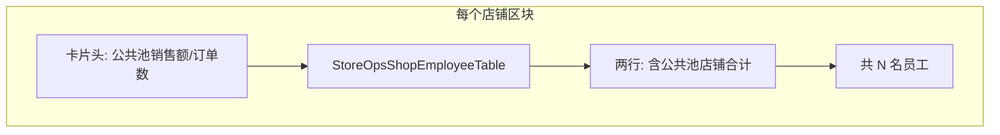

# 店铺运营页：员工表汇总行与店铺级「含公共池」合计（做法 1）

## 目标与边界

- **目标**：每个店铺区块内，员工 `el-table` 底部增加 **一行汇总**（各数值列对该店 **全部** `employee_rows` 求和，与排序无关）；表格下方再展示 **两个店铺级指标**（按店独立计算）：
  - **店铺总销售额（含公共池）** = `public_pool_sales_total` + Σ `total_sales`
  - **店铺总订单数（含公共池）** = `public_pool_order_count` + Σ `direct_order_count`
- **范围**：仅前端；不改后端、[frontend/src/api/storeOps.ts](frontend/src/api/storeOps.ts) 字段契约不变。
- **业务备注**：若产品后续发现「公共池总额 + 各员工合计销售额」与财务口径重复，应以后端/产品定义为准；本方案按你方已确认公式落地。

---

## 架构说明



- **汇总行（表内）**：Element Plus [`show-summary`](https://element-plus.org/en-US/component/table.html#table-attributes) + [`summary-method`](https://element-plus.org/en-US/component/table.html#table-events)（即你选的 **做法 1**）。`summary-method` 回调参数为 `{ columns, data }`，其中 `data` 为当前表格数据（本项目即 `sortedRows`）；**求和用 `data` 即可**（仅行顺序变化，加总不变）。
- **两个「含公共池」指标（表外）**：`summary-method` 只返回 **与列一一对应** 的数组，不适合在同一行里塞两段独立语义文案；放在 **[StoreOps.vue](frontend/src/views/StoreOps.vue) **中、表格与「共 N 名员工」之间的 **小块展示**（或并入同一条 footer 的上下两行），数据只依赖 `shop`，**不依赖排序**，与表内汇总 **口径一致**。

---

## 实现细节

### 1）子组件 [frontend/src/components/StoreOpsShopEmployeeTable.vue](frontend/src/components/StoreOpsShopEmployeeTable.vue)

在 `<el-table>` 上增加：

- `show-summary`
- `:summary-method="employeeTableSummary"`

**`employeeTableSummary` 逻辑（建议独立函数 + 单元风格注释）**：

- 入参：`{ columns, data }`，`data` 类型为 `StoreOpsEmployeeSortRow[]`（与现有 `sortedRows` 一致）。
- 返回：`string[]`，长度与 `columns.length` 一致，与 **当前列顺序** 对齐（遍历 `columns`，用 `column.property` 分支；首列无 `property` 时用索引 0 作为「标签列」）。
- **第 1 列（员工 Slug）**：固定文案 **`汇总`**（或 `合计`，全页统一即可）。
- **数值列**（与 `prop` 一致）：
  - `direct_sales`、`allocated_from_public_pool`、`total_sales`、`fb_spend`：对 `data` 做 `Number` 累加，`fb_spend` 用 `?? 0`；格式化为 `$` + `formatMoney(sum)`，与表体展示风格一致。
  - `direct_order_count`：整数求和，右对齐样式由列 `align` 继承汇总格样式即可（必要时 `:deep` 微调汇总行字号）。
- **`roas` 列**：**不**对行 ROAS 做算术平均（易误解）。汇总格显示 **`—`**（与空 ROAS 一致）。若未来要「全店加权 ROAS」，再单独开需求：`Σ total_sales / Σ fb_spend`（且 `Σ fb_spend > 0`）。

**与现有能力兼容**：

- **不要**把汇总行塞进 `:data`，避免 `row-key`、排序、程序化 `sort` 互相干扰。
- 保持现有 `defaultSortConfig`、`@sort-change`、`defineExpose({ applySort })` 不变；`show-summary` 一般不触发 `sort-change`；若联调出现异常，再按既有 `isSyncingHeader` 路径排查（预期无需动父组件锁）。

**样式**：在 `scoped` 样式中可对 `.store-ops-employee-table :deep(.el-table__footer-wrapper td)` 做略粗字体或背景，与表体区分（保持与现有 slate 风格一致）。

### 2）父页面 [frontend/src/views/StoreOps.vue](frontend/src/views/StoreOps.vue)

在 `<StoreOpsShopEmployeeTable />` **之下**、现有「共 N 名员工」**之上**（或合并进该 footer 的块内），增加 **按店展示** 的两行或横向两列文案：

- 标签建议：**「店铺总销售额（含公共池）」**、**「店铺总订单数（含公共池）」**（文案可微调，需全店统一）。
- 计算（可用行内 `computed` 封装为小函数，避免模板臃肿）：
```text
sumTotalSales = Σ(shop.employee_rows ?? []).map(r => r.total_sales)
sumDirectOrders = Σ(...direct_order_count)

grandSales = shop.public_pool_sales_total + sumTotalSales
grandOrders = shop.public_pool_order_count + sumDirectOrders
```

- 展示格式：金额用现有 `formatMoney`；订单数为整数。

**空数据**：`employee_rows` 为空时，两指标退化为 **仅公共池**（与上面公式一致）。

### 3）可选小工具

若希望单测与复用：在 [frontend/src/utils/storeOpsSort.ts](frontend/src/utils/storeOpsSort.ts) 或新建 `frontend/src/utils/storeOpsAggregates.ts` 中增加 `sumEmployeeColumn(rows, key)`、`shopGrandTotals(shop)` 纯函数；**非必须**，以代码重复度为准。

### 4）验证清单

- `cd frontend && npx vue-tsc --noEmit` 通过。
- 两店各自：汇总行各列之和与手工在 Excel/计算器核对一致；换排序后 **汇总行数值不变**。
- 「含公共池」两项 = 卡片头公共池 + 表内 Σ 对应列。
- 控制台无 `Maximum recursive updates`（回归现有排序防环逻辑）。

---

## 涉及文件

| 文件 | 变更 |

|------|------|

| [frontend/src/components/StoreOpsShopEmployeeTable.vue](frontend/src/components/StoreOpsShopEmployeeTable.vue) | `show-summary`、`summary-method`、汇总行样式 |

| [frontend/src/views/StoreOps.vue](frontend/src/views/StoreOps.vue) | 表格下方展示两个店铺级「含公共池」指标 |

| 可选 | `storeOpsAggregates.ts` 或 `storeOpsSort.ts` 旁路纯函数 |

---

## 风险与回滚

- **风险**：ROAS 汇总显示「—」可能被误认为遗漏；可在 UI 上加一行小字说明「员工 ROAS 为行级，汇总行不展示」。
- **回滚**：移除 `show-summary` 与父级两块展示即可恢复当前仅员工行展示。