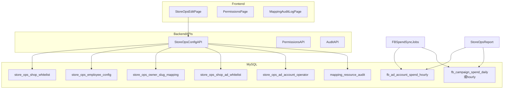

# 店铺运营编辑功能执行方案（唯一执行版）

## 目标与边界

- **目标**：把当前店铺运营配置（店铺白名单、广告账户白名单、员工与 UTM 关键词、owner→slug 映射）从代码硬编码迁移为可视化管理；支持**同一广告账户仅绑定一个店铺**（禁止跨店重复绑定同一 `ad_account_id`）；支持**同一账户绑定一名或多名运营人员**；当运营人数达到 **2 人及以上** 时启用多运营（按广告系列名称关键词归因），仅 1 人时按单运营逻辑；单运营不启用系列级拉取，以降低 Graph API 消耗。
- **边界**：
  - 阶段 A/B/C 全部能力（配置中心 + 同步与报表改造 + 权限与审计）。
  - 不做批量导入/导出。
  - 做审计日志、冲突检测、新增权限「编辑店铺运营配置」。
  - 新增独立页面「店铺运营编辑」。
  - **历史重算**：日常规则为「改配置仅影响之后新同步的日期」；日后若需重算某段历史，通过**单独脚本/任务**（见文末），不作为默认自动行为。

## 现状与痛点（依据现有代码）

- 店铺运营核心配置目前在硬编码文件：
  - 员工 slug 白名单在 [backend/app/services/store_ops_constants.py](backend/app/services/store_ops_constants.py)
  - UTM 命中逻辑在 [backend/app/services/store_ops_attribution.py](backend/app/services/store_ops_attribution.py)（`strip` + 小写子串匹配、名单顺序优先）
  - 店铺与 FB 白名单、owner→slug 在 [backend/app/services/store_ops_fb_mapping.py](backend/app/services/store_ops_fb_mapping.py)
- **FB 花费入库现状**：[db/schema.sql](db/schema.sql) 中 `fb_ad_account_spend_hourly` 为**账户 + 小时**粒度，**无** `campaign_id` / `campaign_name`；[fb_spend_sync.py](fb_spend_sync.py) 使用 `level=account` 的 Insights，**未**拉取系列维度。多运营归因需**新增**系列级明细存储与同步分支。
- 审计：映射资源审计能力可复用（[backend/app/api/mappings_api.py](backend/app/api/mappings_api.py)、[backend/app/api/audit_api.py](backend/app/api/audit_api.py)、[frontend/src/views/MappingAuditLog.vue](frontend/src/views/MappingAuditLog.vue)）。
- 权限扩展：[backend/app/api/permissions_api.py](backend/app/api/permissions_api.py)、[frontend/src/views/Permissions.vue](frontend/src/views/Permissions.vue)。

## 目标业务规则（已确认口径汇总）

### 店铺与账户

- **员工可属于多店**；**UTM 关键词**在员工维度全局一致（每员工 1 个 UTM 关键词，与订单归因一致）。
- **新增店铺**时自动继承当前员工配置（仅配置继承，历史订单数据不继承）。
- **广告账户**：`UNIQUE(shop_domain, ad_account_id)`；**同一 `ad_account_id` 全局不可出现在第二家店铺**（跨店禁止）。
- 新增店铺/账户前须在映射编辑中已存在（与既有「主映射」校验一致）。
- 店铺运营归因按账户隔离：多运营匹配仅在**当前广告账户**返回的系列数据内进行，不跨账户混合匹配。

### 单运营 vs 多运营（FB 花费）

| 模式 | 判定 | FB 数据拉取 | 花费归属 |

|------|------|-------------|----------|

| **单运营** | 某白名单账户下仅绑定 **1** 名运营 | 沿用 **账户级** Insights（与现有 [fb_spend_sync.py](fb_spend_sync.py) 路径一致），**不**拉 campaign 级 | 该账户花费全部计入该员工 |

| **多运营** | 某白名单账户下绑定 **≥2** 名运营 | 对该账户拉 **Insights `level=campaign`**，落库系列级 spend | 按**广告系列名称**匹配关键词；**不**为控制消耗而对单运营账户拉系列 |

### 系列名称关键词（仅多运营启用）

- 在配置**多运营**时，为**每名运营**配置 **1 个**「系列关键词」（与 UTM「每员工一个词」的设计平行，但语义作用于 **campaign name**，且**按广告账户维度配置**，因同一员工在不同账户可设不同系列命名习惯）。
- **规范化**：与 UTM 一致 —— 对系列名称做 **`strip()` + 全串小写** 后再做**子串包含**匹配（见 [store_ops_attribution.py](backend/app/services/store_ops_attribution.py) 中 `haystack` 处理方式）。
- **匹配顺序**：使用**该广告账户下运营人员录入顺序**（首位、第2位、第3位...）。对系列名依次检查每名运营的关键词是否被包含；**先命中者优先**（首次匹配胜出）。包含关系（如 `jie` 与 `jieni`）**不**单独禁止，完全由顺序决定归属。
- **未命中**：若系列名**不包含**任何一名运营的关键词，该系列花费归**配置顺序第一位**的运营人员。
- **校验**：多运营模式下**禁止**任何一名运营的关键词为空（保存时拒绝），且同一账户内关键词不可重复。
- **UI 交互**：通过 `+` 新增运营人员；当人数达到 2 人及以上即为多运营模式；不提供手动调序按钮。

### 配置生效范围

- **修改配置（含顺序、关键词、人员增删）**：仅对**之后新同步的日期**生效；**不**自动回溯重算已落库的历史汇总。
- 若日后需对过去区间按新规则重算：依赖**持久化的系列级花费明细** + **独立重算脚本**（重新应用规则或按需重新请求 Insights），见「历史重算」。

### 删除语义（与初版一致）

- **店铺**：仅禁用（软删除），禁用后不在店铺运营页展示，配置可保留。
- **员工**：可删除；若被白名单引用，提示引用数；确认后相关行 `employee_slug` 置空（无），该账户不再参与员工维度展示。

### Owner 强校验（修订）

- **单运营**：新增/修改白名单时，映射编辑中 `ad_account_owner_mapping` 的 **owner（中文）** 需与所选员工通过 `store_ops_owner_slug_mapping` 对应一致。
- **多运营（强约束）**：映射表中的 owner 必须与**首位运营**对应一致；不一致直接保存失败。其余位运营必须来自店铺运营中已存在员工列表。

## 方案总览（架构）

## 数据模型设计（修订）

### 配置表（与初版一致部分）

- **`store_ops_shop_whitelist`**：`shop_domain`（unique）、`is_enabled`、时间戳；校验 `shop_domain` 已存在于主映射店铺表。
- **`store_ops_employee_config`**：`employee_slug`（unique）、`utm_keyword`（unique，非空，存小写）、`is_enabled`；slug 格式 `[a-z][a-z0-9_]{1,31}`。
- **`store_ops_owner_slug_mapping`**：`owner_name`（unique）、`employee_slug`（FK 逻辑关联员工表）。

### 广告账户白名单 + 多运营子表（替代「单行单 employee_slug」）

- **`store_ops_shop_ad_whitelist`**
  - `id`、`shop_domain`、`ad_account_id`、`is_enabled`、时间戳
  - 约束：`UNIQUE(shop_domain, ad_account_id)`；`ad_account_id` **全局**唯一（可 `UNIQUE(ad_account_id)` 实现跨店禁止）
  - 校验：`ad_account_id` 存在于 `ad_account_owner_mapping`

- **`store_ops_ad_account_operator`**（一名或多名运营绑定到同一白名单账户）
  - `id`、`whitelist_id`（FK → `store_ops_shop_ad_whitelist.id`）
  - `employee_slug`（FK 逻辑 → `store_ops_employee_config`）
  - **`sort_order`**（正整数，唯一于 `whitelist_id`）：用于固化录入顺序（不提供手动调序 UI），决定首次匹配顺序与首位兜底人员
  - **`campaign_keyword`**：`NULL` 允许仅当父级为单运营；父级多运营时 **NOT NULL** 且非空串（应用层 + DB 检查）
  - 约束：`UNIQUE(whitelist_id, employee_slug)`；同一 `whitelist_id` 下行数 = 1 → 单运营；≥2 → 多运营

### FB 系列花费明细（方案 A，供多运营归因与可选历史重算）

- 新建表（命名示例）：**`fb_campaign_spend_daily`**（或按小时，视 API 与体量定；首版可 **按天** 降低量）
  - `stat_date`（DATE，业务日，建议与店铺运营看板一致，明确时区规则）
  - `ad_account_id`
  - `campaign_id`、`campaign_name`（Insights 返回；**持久化 id** 利于改名与重算）
  - `spend`、`currency`
  - `created_at` / `updated_at`
  - 唯一键建议：`UNIQUE(ad_account_id, campaign_id, stat_date)` 或含 `stat_date` 的等价组合

**说明**：单运营账户**不写**此表（或写但不参与归因，以简化）；推荐 **仅多运营账户** 写入系列明细，与业务规则一致。

## 后端改造计划

- **新增** [backend/app/api/store_ops_config_api.py](backend/app/api/store_ops_config_api.py)（或等价模块）：店铺、员工、owner 映射、白名单 + **运营子行**批量保存（事务）。
- **服务层 / DB**：[backend/app/services/database_new.py](backend/app/services/database_new.py) 增 CRUD、冲突检测、**保存多运营时校验关键词非空与 `sort_order` 连续或唯一**。
- **FB 同步**（新建模块或扩展现有脚本）：
  - 读取配置：若账户为单运营 → 仅调用账户级 Insights → `fb_ad_account_spend_hourly`（现有逻辑）。
  - 若为多运营 → 调用 **`level=campaign`** Insights，写入 **`fb_campaign_spend_*`**；归因函数输入：系列名 + 该账户 `store_ops_ad_account_operator` 有序列表 → 输出 `employee_slug` → 聚合到「按店按员工」供报表使用（可在聚合表或查询时计算）。
- **保存校验（强约束）**：
  - 多运营人数必须 `>=2`（人数=1 视为单运营，不启用系列归因）；
  - 多运营时首位运营需与映射编辑负责人一致；
  - 多运营时每行 `campaign_keyword` 必填且同账户不可重复。
- **报表**：扩展 [database_new.py](backend/app/services/database_new.py) 中 `fetch_store_ops_fb_spend_by_shop_slug`（及 [store_ops_report.py](backend/app/services/store_ops_report.py)）：
  - 单运营账户花费来自账户表；
  - 多运营账户花费来自系列表经规则聚合后的按人汇总；
  - **对账（建议）**：多运营账户下，系列 spend 按日求和 vs 同账户同区间账户级 spend 比对，超阈值打 `warning` 日志。
- **归因读取**：`store_ops_attribution` / 常量列表逐步改为读 `store_ops_employee_config`（UTM）；系列名归因独立纯函数，**不**与 UTM 混用同一表字段。
- **审计**：复用 `mapping_resource_audit`，扩展 `resource_type`（如 `store_ops_ad_operator`）。

## 前端改造计划

- [frontend/src/views/StoreOpsEdit.vue](frontend/src/views/StoreOpsEdit.vue)（新建）
  - 白名单店铺、员工与 UTM、owner 映射（与初版同）。
  - **广告账户白名单**：选择店铺与账户后，运营人员区块支持点击 `+` 新增第2人及以上；仅当 **≥2 人** 时显示并必填每人系列关键词；单运营时隐藏系列关键词列；不提供拖拽/上下移动手动调序。
- 路由 / 菜单 / 权限：同初版，`can_edit_store_ops_config`。

## 权限设计

- 同初版：`can_edit_store_ops_config`，管理员旁路，前端以后端为准。

## 冲突检测与删除策略（补充）

- 多运营保存：同一 `whitelist_id` 下若 ≥2 条 operator，任一 `campaign_keyword` 为空或重复 → **400**。
- 多运营保存：首位运营与映射负责人不一致 → **400**（强校验）。
- 其余：店铺/账户存在性、跨店账户、同店重复账户，同初版。

## 迁移与兼容策略

1. 建新表 + 将 [store_ops_fb_mapping.py](backend/app/services/store_ops_fb_mapping.py) 等硬编码**回填**为新表结构（单运营可先插 1 行 operator，`campaign_keyword` 为 NULL）。
2. 读路径：**新表优先**，常量兜底，验证后仅新表。
3. FB：先上线**读侧合并逻辑**，再切换同步任务写系列表（避免空窗）。

## 历史重算（可选脚本，非默认）

- **前提**：已存在 **`fb_campaign_spend_*` 明细**时，可对 `[start_date, end_date]` **仅重新跑归因规则**（不写 FB），更新按人汇总缓存或下游表。
- 若明细缺失或需纠数，脚本对区间内多运营账户 **重新请求** campaign Insights 再归因。
- 参数建议：`start_date`、`end_date`、可选 `shop_domain` / `ad_account_id`；审计记录「手动重算」。

## 调度与运行方式（结合现网）

- 继续复用现有 Windows 任务计划：
  - `run_fb_spend_sync.bat`：每 5 分钟运行，调用 `fb_spend_sync.py --incremental`；
  - `run_fb_spend_sync_yesterday.bat`：每天 08:02 运行，调用 `sync_yesterday_fb_spend.py`（内部按昨天日期触发 `fb_spend_sync.py --date`）。
- 双路径同步优先在 [fb_spend_sync.py](fb_spend_sync.py) 内扩展，不新增第三条调度任务作为默认方案：
  - 单运营账户走账户级；
  - 多运营账户走 campaign 级。
- 运维目标：最小化任务调度改造，集中改动在同步代码与数据模型。

## 验收与测试清单

- 单元测试：多运营关键词匹配顺序、未命中归首位、规范化（大小写/空白）、多运营关键词为空拒绝。
- 单元测试：多运营人数阈值（1人为单运营，2人及以上为多运营）。
- 单元测试：多运营首位与映射负责人不一致时保存失败。
- 单运营路径：**无** campaign Insights 调用（mock 断言）。
- 集成：单/多混合店铺报表；对账日志；配置变更后仅新日期生效（用 mock 日期或测试库验证）。
- 人工：权限、审计筛选、禁用店铺不展示。

## 风险与规避

| 风险 | 规避 |

|------|------|

| Campaign Insights 量与限流 | 仅多运营账户拉系列；优先按天粒度；异步报告轮询复用现有模式 |

| 系列名归因与 UTM 订单归因不一致 | 文档标明：订单仍用 UTM；FB 花费用系列关键词；业务自行统一命名 |

| 配置与历史混淆 | 明确「仅新同步日期」+ 重算走独立脚本 |

| owner 首位强校验导致保存失败 | 在前端保存前实时提示映射负责人并高亮首位规则，减少误操作 |

## 实施阶段（A/B/C）

- **A**：数据层（配置表 + operator 表 + 系列花费表）、迁移、初始化回填。
- **B**：Config API、FB 同步双路径、报表合并与对账、审计。
- **C**：店铺运营编辑 UI（多运营 + 顺序 + 系列关键词）、权限、上线验证与操作说明（含回填脚本与可选历史重算说明）。